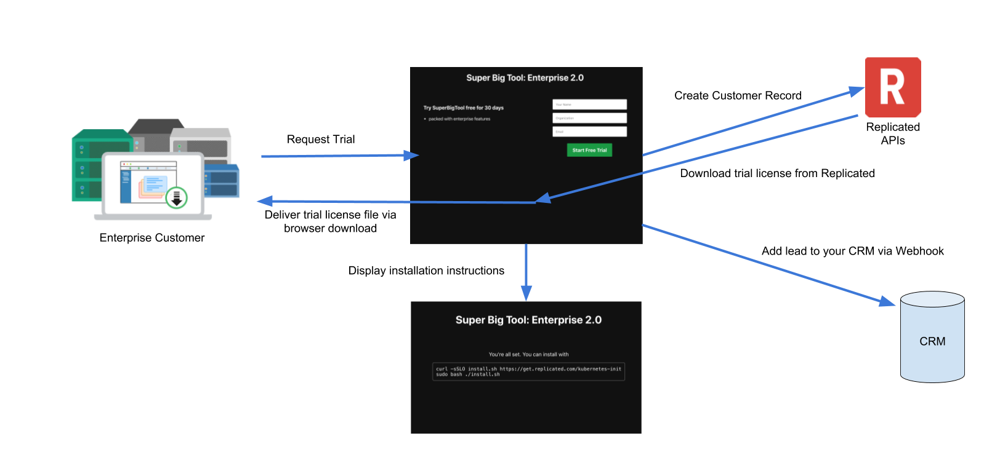
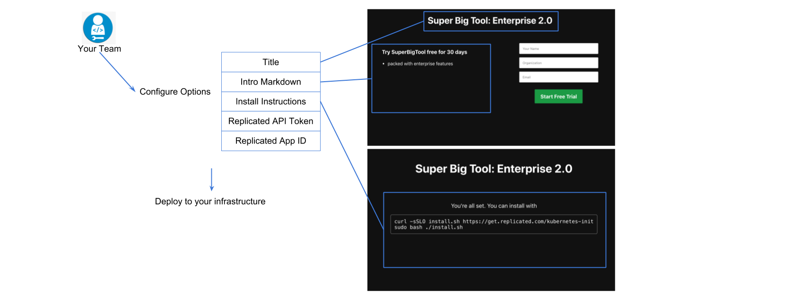

Enterprise GTM Starter
====================

Example project showcasing how to use Replicated vendor APIs to build a go-to-market portal to allow end customers to self-service signups and license downloads.

How it works
------------

During operation, the project runs a web app and a backend API to generate and deliver new trial licenses for your app. When a user requests a trial, it will:

- Create a new customer record in Replicated
- Download the license from Replicated and deliver it to the user via browser download
- Deliver webhooks to update any configured CRM systems with the user's provided info
- Display configured installation instructions to the user



Deploying
---------------------

The Enterprise GTM starter can be configured and deployed directly to your existing Kubernetes cluster. The recommended installation method is to use [ship](https://github.com/replicatedhq/ship).

```
brew install ship
ship init github.com/replicatedhq/enterprise-gtm-starter
```

Ship will walk you through setting up the required fields for running the project in your infrastructure. These include

- Replicated API token and Application details
- Trial duration and expiration behavior
- Custom copy and whitelabeling



Customizing
---------------------

As noted in [deploying](#deploying), there are a number of options that can be used to customize the messaging and operation of the go to market portal. However, while the project aims to present some basic customizations, it is also designed to be a minimal POC. Therefore, rich customization like CSS, extra fields, etc are not supported. Instead, it's recommended that you import or copy the relevant pieces of this project into your own application.

Developing
------------

- Create a kustomize overlay with your username:

```bash
mkdir kustomize/overlays/dev_${USER}
```

```bash
echo '
bases:
  - ../dev

patches:
  - ./deployment.yaml
 ' > kustomize/overlays/dev_${USER}/kustomization.yaml
```
- create the placeholder patch:
```bash
echo 'apiVersion: apps/v1
kind: Deployment
metadata:
  name: backend
spec:
  template:
    spec:
      containers:
        - name: backend
          env:
            - name: REPLICATED_API_TOKEN
              value: edit me
            - name: REPLICATED_APP
              value: edit me
            - name: REPLICATED_CHANNEL_ID
              value: edit me
  ' > kustomize/overlays/dev_${USER}/deployment.yaml
```
- Edit `kustomize/overlays/dev_${USER}/deployment.yaml` with your app ID and API keys from vendor.replicated.com (you can create an API token from the "teams and tokens" page. You can get your channel ID from `replicated channel ls` with the [replicated CLI](https://github.com/replicatedhq/replicated)
- Get [Tilt](https://github.com/windmilleng/tilt)
- Get a kubernetes cluster (probably in Docker for Desktop but Minikube/GKE/EKS/etc.. works fine too)
- run `tilt up` to run the stack and watch for changes
- navigate to http://localhost:3000
